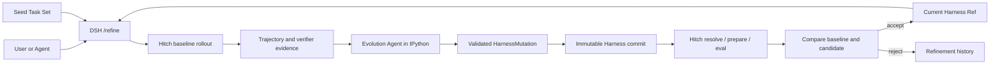

# DSH Self-Evolving Harness Plugin Spec

- 状态：Draft v0.4
- 目标运行时：DeepSeek Harness（DSH）
- 设计参考：Prime Agent persistent IPython + `/refine`
- 版本与评测后端：Hitch 0.1.x
- 更新：2026-08-19 — v0.2：采纳"cell 执行入 session 日志"的日志重建原则；补充双层模型与成本分层；轨迹 JSONL 消费契约；baseline 复用；评测两层隔离；DSH 落地规范要求
- 更新：2026-08-19 — v0.3：按 DSH 与 agent-hitch 源码核查结果修订——V1 动作空间按 DSH 现有能力逐项标注落地现状并给出收窄规则；Hitch 集成写明三件实际交付物（adapter 源码修改、DSH stdout NDJSON 事件输出模式、eval 本地源限制与 V1 绕行路线）；新增 HarnessLoader 装配落点映射（preset / skill provider / systemPrompt section）；新增评测过拟合防护与待验证假设
- 更新：2026-08-19 — v0.3.1：§7 的具体改动设计移入独立文档 [Hitch ↔ DSH 对接改动](hitch-dsh-integration.md)（adapter 形态、事件映射表、"为何不事后解析 session log"论证、实施顺序）
- 更新：2026-08-19 — v0.3.2：纳入 agent-hitch 工作区新能力（未提交改动）——复用清单新增 `--resolved-revision-file`、`memory_mb`、`HITCH_EVAL_BOOTSTRAP_DIR`；详见对接文档 §2.3、§4
- 更新：2026-08-19 — v0.3.3：完整性补全——新增 §12 Seed Task Set 与分数（任务格式、seed repo 独立化、verifier 声明式、score=通过率、held-out 隔离由 handler 强制）；§6 新增并发/中断/预算语义（单 round 锁、中断轮标记 failed 不续跑、`--budget B`=rollout timeout）；§5 补 champion 运行时生效路径；§9 补 seed repo 布局；§10 补两条 seed 相关验收条目
- 更新：2026-08-20 — v0.4：修正 Hitch/DSH 已提交源码基线；区分 production champion 与 evaluation candidate 加载；新增 EvaluationRecord 与 evaluation context digest；把 verifier 权威记录从 Hitch rollout 中拆出；收紧 declarative 自动晋升白名单；禁止任意 IPython cell 自动执行回放；补 stochastic 评测、held-out 物理隔离、canonical manifest digest 与可信 seed registry

## 1. 目标

实现一个运行在 DSH 内的自进化 Harness plugin：

1. 为每个 DSH session 提供持久 IPython 环境；
2. 提供 `/refine`，根据指定 Seed Task 分析当前 Harness，并在受限动作空间内生成、验证和评测改进；
3. 使用 Hitch 管理不可变 Harness revision、构建产物、隔离运行、评测记录和回滚所需历史。

V1 只演进 Harness，不演进 Seed Task、模型或 DSH Agent Loop。

## 2. 核心原则

- **小步修改**：一次 refinement 只修改一个语义目标，便于归因和回滚。
- **证据驱动**：每个修改必须引用 Seed Task trajectory、错误或 verifier 结果。
- **先计划后应用**：proposal 生成期间不修改 Harness；应用前使用 parent digest 做 CAS 检查。
- **候选隔离**：candidate 不修改当前 champion，也不在当前 turn 中热替换正在执行的 Harness。
- **评测决定激活**：candidate 通过相同 Seed Task、模型、环境和预算的对照评测后才能成为 champion。
- **基础层不可变**：原始 DSH system prompt、模型、权限和 evaluator 不属于自动修改范围；`system_prompt` mutation 只修改 supplemental prompt layer。
- **日志重建**：模型的决策依据必须可从 session 日志重放（`cell/run` 入日志）；IPython 变量只是可丢弃的便利状态，不是真相源。
- **两层隔离**：评测的版本隔离（固定 DSH 与 overlay，排除版本漂移）与进程安全（Harbor / 该版本 DSH 自身 sandbox）是两个正交维度，不混用；采样噪声另由配对评测控制。
- **权威记录分层**：Hitch 权威记录 revision、artifact、workspace、rollout 事件与 terminal result；RefineService 权威记录 verifier 执行、score、promotion decision 与到 Hitch run 的引用。不得声称 Hitch `events.jsonl` 自带 verifier 分数。
- **加载目标可证明**：production session 从 champion pointer 加载；evaluation session 从 Hitch artifact 内钉死的 candidate 加载并忽略 ambient champion pointer。每次 rollout 必须能反查实际 overlay digest 与 DSH base revision。

## 3. 架构



DSH plugin 包含五个组件：

- `PythonNotebookRuntime`：管理 per-session IPython kernel；
- `RefineCommand`：注册 DSH `/refine` slash command；
- `RefineService`：执行 refinement 状态机；
- `HarnessLoader`：把 champion/candidate overlay 装配进 DSH；
- `HitchClient`：只调用 Hitch CLI、daemon 和 schema，不复制 Hitch 内部实现。

## 4. Persistent IPython

每个 DSH session 拥有一个独立 kernel。kernel 在多次 tool call 和 context compaction 之间保持变量、import、函数和分析结果。

IPython 的设计理由是**上下文外置（context offloading）**：分析状态放在环境里，模型只传递引用、不传递值。

- **引用优于值**：模型说"用 baseline_metrics 对比 candidate_metrics"，上下文里只有符号，值在 kernel 里——上下文变短、KV 命中率上升、推理成本下降；
- **编排性**：分析逻辑（读轨迹 → 清洗 → 聚合 → 统计）写成 cell 序列，中间结果保留、逐步可审查，分析代码本身成为可 diff、可沉淀为 skill 的 harness 组件；
- **长任务连续性**：变量跨 tool call 和 compaction 保持，compaction 压缩上下文不丢分析状态。

模型可见工具：

```ts
interface IpythonInput {
  code: string
}
```

最低能力：

- cell 串行执行，支持 stdout、stderr、result、display 和异常；
- 支持 interrupt、restart、dispose；
- 可选 safe snapshot，session resume 时逐变量恢复——**便利功能，不是真相源**；变量缺失时由模型重新分析，或只重放显式标记为 pure/replayable 的 cell；
- kernel restart 后撤销旧 generation 的 Host Bridge handle；
- kernel 不保存模型 credential、Hitch token 或 DSH Host authority；
- 每个 kernel 配置 idle timeout、最大存活时间和输出上限；进程启动/退出登记 generation，宿主重启时清理孤儿进程。

### 日志与回放（模型可见 ⟺ 已入日志）

- 每个 cell 的**输入代码 + 输出结果**作为一个 session event 追加进 session 日志（`cell/run`），至少记录 execution id、kernel generation、开始/结束时间、terminal status、是否声明 replayable，以及大输出引用；
- 模型引用变量而做出的决策，其依据（cell 输出）必须能从日志重放得到——模型视角可由日志重建；
- 变量值本身是衍生状态，不入日志；snapshot 是可丢弃的恢复便利。**审计回放**读取历史输入/输出但不执行代码；**执行回放**只允许无 Host Bridge 调用、文件写入、网络、进程或其他外部副作用的显式 pure/replayable cell；
- `cell/run` 事件同时是 trajectory 证据的一部分，供外层 meta agent 分析与归因。

任意 cell 不得在 resume 时自动重执行。尤其禁止自动重放 `hitch.*`、`refine.*`、Git、文件写入和网络调用；Host Bridge 的有副作用方法还必须接受 idempotency key，避免客户端超时重试重复创建 run、candidate 或 promotion。

预加载的 typed Python API：

```python
harness.current()                 # 当前 Harness manifest 和 ref
seed_tasks.load(ref)              # 读取 Seed Task Set
trajectory.query(round_id, ...)   # 分析 rollout evidence
await hitch.status(run_id)        # 查询 Hitch run/eval
await refine.run(seed_tasks=...)  # 与 /refine 共用 RefineService
```

Python API 通过 DSH Host Bridge 执行。kernel 可以分析和提交 proposal，但不能直接写 Harness repo、创建 commit 或切换 champion。

## 5. Harness 与动作空间

一个 Harness revision 是可由 DSH 加载的不可变 overlay：

```text
harness/
  manifest.json
  prompts/
  memories/
  skills/
  hooks/
  workflows/
```

```ts
interface HarnessManifest {
  schemaVersion: 1
  parentRef?: string
  dshRevision: string             // exact full commit 或 exact package version + integrity
  artifacts: Array<{ path: string; digest: string }>
  digest: string
}

interface HarnessMutation {
  parentRef: string
  parentDigest: string
  target: SemanticTarget
  ops: ArtifactOp[]
  rationale: string
  evidenceRefs: string[]
  expectedOutcome: string
}

type ArtifactOp =
  | { type: 'create'; path: string; content: string; expect: 'absent' }
  | { type: 'patch'; path: string; patch: string; expectedDigest: string }
  | { type: 'delete'; path: string; expectedDigest: string }
```

### Canonical digest 与原子应用

- `digest` 使用 `sha256`；输入为规范化 manifest（排除 `digest` 字段）与 artifact 清单的 canonical JSON，object key 排序、artifact 按 UTF-8 path 排序；
- artifact 文件按原始 bytes 计算 `sha256`，文本写入统一 UTF-8，但不在校验时隐式修改换行；path 使用 `/` 分隔的 NFC 相对路径；
- artifact 清单必须与 checkout 中允许目录下的普通文件一一对应；拒绝未声明文件、重复/大小写折叠冲突路径、device/FIFO/socket、hardlink 和任何 symlink；
- `patch` V1 固定为 UTF-8 unified diff，必须完整命中单一已声明文本文件且应用后重新校验 expected digest；不允许 fuzzy apply；
- mutation 在临时 worktree 中整批验证和应用，重新计算全部 digest，通过 parent ref/digest CAS 后一次 commit；任一 op 失败时不产生 candidate commit，也不修改 champion pointer。

V1 动作空间，按 DSH 现有能力标注落地现状（核查于 2026-08-19）：

| Target | 可修改组件 | DSH 落地现状 |
| --- | --- | --- |
| `context` | supplemental system prompt、skill catalog、tool visibility、history/compaction policy、ordering | **现成**：`ctx.systemPrompt.section()`（agent scope，order 约定见 system-prompt 包）；`ctx.skills` 分层 catalog；preset 组合决定 tool visibility；`compaction-basic` config（thresholdRatio、retainTokens、per-model modelPolicies） |
| `pre_action` | validation、routing、planning | **现成**：`agent/pre-step`、`tools/pre-execute` waterfall listener（overlay 以插件/preset 文件形态承载） |
| `post_action` | normalization、retry、experience extraction、reflection、workflow update | **部分现成**：normalization 走 `tools/post-execute`，retry 存在于 compaction policy 与 tools waterfall；experience extraction 与 reflection 在 DSH **无对应组件**，V1 不开放（需先建 substrate） |
| `skill` | 正文与 catalog、invocation policy、trigger、verifier、recovery | **受限现成**：DSH skill 是 `SKILL.md` + frontmatter，一等字段仅 `modelInvocable`/`userInvocable` + 自由 `metadata` 透传；trigger/verifier/recovery 语义经 `SkillCandidate.metadata` 承载、由 refine 插件解释执行，不改 skill schema |
| `routing` | tool、skill、subagent routing | **现成**：分层 registry + preset + `ctx.subagents` 多后端；模型和 provider 固定 |
| `memory` | retrieval、write policy、retention | **受限现成**：DSH 无独立 memory 组件，V1 仅开放 compaction policy；独立 memory substrate 后续版本再议 |
| `verifier` | correctness、quality、safety、cost | **需新建**：以 overlay `workflows/` 内脚本承载；candidate verifier 不能单独决定自身 promotion |

**V1 收窄规则**：只有标注"现成"或"受限现成"的组件可产生可应用的 mutation；标注"需先建 substrate"或"无对应组件"的子项，meta agent 的 proposal 一律走 rejected-for-substrate 决策——记录意图与证据、不应用，待人工实现 substrate 后在后续版本开放。校验器按本表实现白名单。

默认一次 Mutation 只能命中表中的一个组件。绝对路径、`..`、symlink escape、任意 shell operation 和修改 evaluator/Hitch/权限的操作必须被拒绝。

“可应用”不等于“可自动晋升”。V1 风险分级：

- **safe-declarative（可自动评测/晋升）**：纯文本 supplemental prompt；受限 frontmatter schema 的 `SKILL.md`；只含 JSON scalar/array/object 的已知数据配置。不得出现 `!!js`、模块/插件路径、命令、动态表达式、credential、权限、网络、provider/model 或 tool registry 变更；
- **executable（只生成 candidate，Harbor + 人工确认）**：hook、tool、plugin/preset row、workflow/verifier 脚本、Cordis 可执行配置、`agent/pre-step`/`tools/*` listener、subagent backend 或任何能加载代码/发起进程的配置；
- **forbidden（不产生 candidate）**：evaluator、Hitch、权限/credential/网络策略、模型/provider、DSH Agent Loop、trusted launcher/build recipe 和 seed/held-out 数据。

因此表中的 `pre_action`、可执行 `post_action` 和 routing substrate 即使“现成”，也不属于 safe-declarative 自动 promotion。validator 必须按 artifact 内容与加载语义判级，不能只按目录名或扩展名判定；Cordis YAML/preset 并不天然是 declarative 安全数据。

### HarnessLoader 的 DSH 装配落点

DSH 没有 overlay 差量装配原语（`packages/extensions` 的 `cordis_mount` 是进程内存级挂载，无持久化/晋升路径，明确**不用于** champion 装配，仅供 meta agent 在受控 session 内做一次性实验）。`HarnessMutation` 先在专用 harness repo 中解析为完整 artifact 树再 commit；DSH 永远加载完整树，不在运行时做 diff 合并。

HarnessLoader 必须有两个互斥入口，不能用一个 ambient pointer 同时承担 production 和 evaluation：

1. **ProductionChampionLoader**：仅在新 production session 创建时读取 `.dsh-refine/champion.json`，校验该 ref 已被接受、manifest/digest 与 DSH revision 合法，然后物化并选择对应 agent preset；已运行 session 不热替换，resume/fork 重建同一已钉 ref。
2. **PinnedEvaluationLoader**：由 `dsh-evolving` prepared artifact 提供 exact overlay；忽略 `.dsh-refine/champion.json` 和用户级 preset/settings，只加载 artifact 内的 candidate/champion ref。rollout 的首个结构化记录必须包含 harness ref、overlay digest、DSH revision 与 loader mode，RefineService 将其与 expected identity 联合校验。

装配落点：

- **production 整体载体：agent preset**（`packages/preset/agent-presets`）。preset 在 agent scope 下挂载、随 session 生命周期回收；
- **headless evaluation**：当前 headless bundle 没有 preset roster，也不会自动选择 agent preset。V1 必须二选一并由 REAL-composition 测试固定：扩展 headless runner 显式选择 pinned preset，或由 artifact 构建把完整 overlay 编译成 one-shot 全局 `--patch`。不得仅把 preset 文件放进目录后假定生效；
- **skill**：自定义 `SkillProvider` 在选中的 overlay scope 注册，`locator` 指向 exact commit 内的 skill 文件；同名 skill 依 nearest-layer-wins 覆盖。若使用 `skill-filesystem.customSkillDirs`，仍必须从 pinned artifact 目录派生并记录 digest；
- **supplemental prompt**：通过选中 scope 的 `ctx.systemPrompt.section()` 注册；
- **自修改不落运行时**：所有可晋升状态只来自 harness repo commit；`cordis_mount` 实验状态不持久、不参评。

## 6. `/refine` 合同

```text
/refine <seed-task-ref> [--rounds N] [--budget B] [--target TARGET]
/refine status [ROUND_ID]
/refine rollback <HARNESS_REF>
```

`/refine` 运行在 DSH command plane，不作为普通 user message 发送给 Target Agent。`await refine.run(...)` 与 slash command 调用同一个服务，并在当前 turn 结束后的 idle boundary 执行。

### 双层模型与成本分层

refinement 循环由两个模型角色构成，角色分离是刻意的：

| 角色 | 职责 | 模型策略 |
| --- | --- | --- |
| **meta agent（外层）** | 读轨迹、verifier 结果和 refinement history，输出 `HarnessMutation`；只做决策，不执行任务 | 成本分层：使用便宜的中档模型。harness-updating 能力不挑模型，贵模型不带来明显更好的提案（**未验证假设**，见下"待验证假设"） |
| **rollout agent（内层）** | 用固定 dsh revision + candidate overlay 执行 Seed Task，产出轨迹 JSONL 和分数；只执行与产证据，不做决策 | 评测对等性：同一轮 baseline/candidate 使用完全相同模型、provider、sampling 参数（第 8 节） |

两层之间的数据契约不对称：meta 产出 `HarnessMutation`（JSON，小、决策），rollout 产出轨迹（JSONL，大、证据）。meta agent（即下文流程中的 Evolution Agent）运行在独立 DSH session，拥有自己的 scope 和 session 日志，经 `/refine` 命令或 idle boundary 维护任务唤醒；它不接触 champion 之外未验证的 harness 内容。

每轮流程：

1. 固定 champion、Seed Task Set、模型、DSH revision、环境、seed、预算和 `evaluationContextDigest`；
2. 使用 Hitch 对 champion 执行 baseline rollout，由 RefineService 运行 verifier 并生成 baseline EvaluationRecord；
3. meta agent（Evolution Agent）在独立 DSH session/IPython kernel 中读取 champion、baseline trajectory、EvaluationRecord 和 refinement history；
4. 输出一个 JSON `HarnessMutation`；没有充分证据时输出空 proposal；
5. 校验动作空间、风险等级、路径、canonical digest 和 parent digest；
6. 在专用 Harness Git repo 中应用 mutation 并创建不可变 candidate commit；
7. 使用 Hitch resolve/prepare candidate，对 candidate 执行同 context rollout；RefineService 运行同一 verifier 并生成 candidate EvaluationRecord；
8. 在独立 held-out runner 中执行 promotion gate；满足 hard constraints、风险策略和 score 阈值时以 CAS 更新 champion pointer，否则保留原 champion；
9. 记录 proposal、diff、evidence、Hitch run refs、EvaluationRecord refs、context digest、score、decision 和 rollback target。

`--rounds N` 重复上述过程；下一轮只能基于上一轮接受的 champion。失败或拒绝的 candidate 不得成为后续 parent。

baseline 复用取决于 Seed Task Set 的评测模式。`deterministic` 模式下，champion 与完整 baseline cache key 均未变化时可跨相邻轮复用；`stochastic` 模式下不得用旧 baseline 与新 candidate 比较，必须以相同 attempts 和 task 顺序重新做配对评测。champion、seed/held-out revision、evaluation context 或评分策略任一变化都强制重新 baseline。

### 并发、中断与预算

- 同一时刻至多一个 round；重复 `/refine` 调用拒绝并返回当前 round id（champion CAS 串行化的前提）；
- round 各步骤状态持久化于 `rounds/<round-id>.json`；进程重启后中断轮直接标记 `failed`，不做断点续跑——champion 未变时 baseline 结果仍可复用，重跑成本仅 candidate 侧；
- `--budget B` 语义：单任务 rollout 的 wall-clock timeout，经 Hitch `timeout_ms` 传递；token 预算依赖 rollout agent 侧既有配置（如 compaction policy），V1 不引入独立 token 限额机制。为避免单位歧义，CLI help 必须把 `B` 明确为 duration，持久化时只记录规范化 `timeoutMs`。

### 待验证假设

- **"harness-updating 能力不挑模型"**：成本分层的前提，目前无证据。V1 安排同轮 A/B（相同 proposal 生成任务、两档模型）对照提案质量；证伪则 meta agent 升档，并修订成本模型。
- **上下文外置的实际收益**：KV 命中率提升与推理成本下降是推理级推断，V1 记录 cell 输出截断率、compaction 触发频率与上下文长度分布作为间接证据。

## 7. Hitch 集成

Harness overlay Git commit 是版本 ID。Hitch 权威记录 revision、artifact、workspace、rollout events 和 terminal result；RefineService 权威记录 verifier、score、promotion decision 和到 Hitch run 的引用：

```text
# V1 safe-declarative 对照评测走 hitch run（本地 harness repo 可用）
hitch resolve dsh-evolving@git+file://<harness-repo>#<full-sha> --json
hitch prepare dsh-evolving@git+file://<harness-repo>#<full-sha> --json
hitch run --harness dsh-evolving@git+file://<harness-repo>#<full-sha> \
  --workspace-mode worktree --output jsonl ...

# executable candidate 阶段启用 Harbor eval（需 registered remote source，见下）
hitch eval run --backend harbor --harness dsh-evolving@commit:<sha> ...
```

按 2026-08-20 已核查基线，V1 可直接复用 Hitch 已提交的：

- exact commit resolution 和 content identity；
- prepared artifact cache；
- run supervision、timeout、cancel 和 terminal status；
- `worktree | copy` workspace isolation；
- authenticated daemon queue；
- Harbor eval、trial 和 reward records 的基础实现。

当前基线**没有** `--resolved-revision-file`、`HITCH_EVAL_BOOTSTRAP_DIR`、eval `memory_mb`，eval 成功判据也不会因任一 trial errored/cancelled 自动失败。这些只能作为带 exact commit 的待合入 Hitch PR，不能作为 V1 已有接口。V1 对 champion/candidate 分别保存 expected resolution identity，并核对每个 run 实际 identity；二者本来就应不同，不能写成“钉同一 identity”。

当前 Hitch 已有 `deepseek` adapter，但其 revision 是 DSH 本体，不是 overlay repo。仍需新增 `dsh-evolving` definition；具体启动协议、wire schema、字段映射、EvaluationRecord 和 Harbor 路线见 [Hitch ↔ DSH 对接改动](hitch-dsh-integration.md)：

1. **Hitch adapter（源码修改，非配置扩展）**。`revision_sources.commit` 指向 overlay repo，构建命令校验 canonical manifest、固定 exact DSH revision 并生成 launcher。launcher 负责 `--profile headless --patch ... --events jsonl`；adapter 只传位置 task、白名单 headless args 和独立 `DSH_HOME`。
2. **DSH stdout NDJSON 事件模式（DSH 侧前置 PR）**。`--events jsonl` 是 headless app 参数；stdout 只输出带 `schema_version/kind/session_id` 的逐行 JSON，普通模式继续输出最终文本。adapter 按 `SessionEventMap` 精确翻译，最后非空 assistant text 与现有 `summarize()` 一致。
3. **V1 本地评测与 verifier 分层**。`hitch run` 产生 rollout 证据；RefineService 在 retained isolated workspace 执行可信 seed verifier 并生成 EvaluationRecord。score 来自 EvaluationRecord，不从 `events.jsonl` 推断。
4. **executable candidate Harbor 路线**。当前 `hitch eval` 拒绝显式 `git+file`，Harbor 容器还会重新 prepare exact registered ref。放宽守卫本身不能让容器访问宿主 local repo；必须使用真实远端、受校验离线 artifact bundle，或改造 Harbor agent 接收宿主 prepared artifact。

Hitch Harbor 一次只评测一个 Harness ref，因此 baseline 和 candidate 使用两次 evaluation，由 RefineService 以相同 `evaluationContextDigest` 合并。任一 trial errored/cancelled、reward 缺失或 revision identity 不匹配时整轮 failed。Hitch workspace 不是安全 sandbox；executable candidate 必须使用 Harbor Docker 并人工确认。

### 轨迹 JSONL 消费契约

rollout 产出的轨迹 JSONL 是 meta agent 的证据输入。plugin 只消费、不复制 Hitch event/artifact；Hitch run 文件是 rollout 权威，plugin 记录引用位置。verifier 输出不属于 Hitch run，由 EvaluationRecord 引用 RefineService 自己的 immutable logs。

Hitch event 本身不带 `roundId`、`taskRef` 或 verifier score。`trajectory.query()` 通过 EvaluationRecord/round 索引把 `roundId`、`harnessRef`、`taskRef`、run ref 与 Hitch 事件类型/时间序连接成只读视图，不重写源 JSONL。V1 不发明跨系统 spill schema；大输出分别使用 Hitch 现有文件与 RefineService verifier log ref。

Hitch 不决定哪个版本是 champion。DSH plugin 只维护一个最小索引：

```ts
interface RefinementRecord {
  id: string
  parentRef: string
  candidateRef?: string
  mutationRef?: string
  seedRevision: string
  evaluationContextDigest: string
  baselineRunRefs: string[]
  candidateRunRefs: string[]
  baselineEvaluationRefs: string[]
  candidateEvaluationRefs: string[]
  heldOutEvaluationRefs: string[]
  decision: 'accepted' | 'rejected' | 'rejected-for-substrate' | 'failed'
  baselineScore?: number
  candidateScore?: number
  scoreDelta?: number
  createdAt: string
}
```

该索引保存 lineage、evaluation context、score 和 Hitch/EvaluationRecord 引用；不复制 Hitch artifact、event 或 terminal state。

## 8. 评测与激活

baseline 和 candidate 必须使用相同：

- Seed Task revision 和任务顺序；
- 模型、provider、sampling 参数、评测模式和 attempts；
- DSH base revision；
- workspace snapshot/image、permission、seed、timeout 和 token policy；
- verifier 和评分公式。

这些字段规范化后组成 `evaluationContextDigest`；baseline/candidate digest 不同则不可比较。除此之外还必须校验 PinnedEvaluationLoader 输出的实际 overlay digest、DSH revision 与 Hitch revision identity。

自动接受仅适用于 §5 定义的 safe-declarative mutation。修改 executable hook、tool、plugin/preset、workflow 或 verifier code 的 candidate 即使得分更高，也需要 Harbor 与人工确认；权限、网络、credential、模型、provider、evaluator、trusted launcher/build recipe 和 seed data 变更永不自动接受。

### 过拟合防护

Seed Task Set 是固定的优化目标，存在 harness 进化为"针对该任务集与 verifier 的过拟合器"的风险（reward hacking 入口）。V1 规则：

- 在 seed 任务集之外维护一个 **held-out 子集**（同分布、不参与证据引用与 proposal 生成）；champion 切换前在 held-out 上复核，回归超过阈值则拒绝 promotion 并记录；
- held-out 集定期轮换；轮换后相邻轮的 baseline 复用失效，必须重跑；
- refinement history 记录每个 accepted mutation 在 held-out 上的 delta，供外层分析漂移趋势；
- verifier 结果只对 seed 任务集声明效力；任何 proposal 的 evidenceRefs 不得引用 held-out 数据；
- held-out checkout、prompt、workspace 和 verifier 只挂载给独立 held-out runner，不挂载给 meta agent/IPython kernel。Host Bridge 仍拒绝 held-out query/evidence ref，但 handler 校验只是第二道防线，不能替代文件系统隔离。

### 两层隔离

评测环境包含两个正交的隔离维度，不能混用：

- **版本隔离**：评测沙箱固定某次迭代后的 DSH revision + exact overlay，让该组合以同 seed、同模型、同预算执行 Seed Task，排除运行时版本漂移；若 rollout 是 stochastic，版本隔离本身不能排除采样噪声，仍须使用 §12 的配对评测规则；
- **进程安全**：执行不可信代码（模型生成的候选 hook/tool）用 Harbor Docker；rollout 过程中模型经工具执行的代码仍由该版本 dsh 自身配置的 sandbox 管辖。Hitch workspace 不是进程安全边界。

champion 只在任务边界更新。新任务由 `HarnessLoader` 加载新 ref；正在运行的 session 不热替换。rollback 只移动 champion pointer 到已存在且验证过的 Harness ref。

## 9. 最小持久化

```text
.dsh-refine/
  champion.json
  rounds/<round-id>.json
  evaluations/<evaluation-id>.json
  verifier-logs/<evaluation-id>/{stdout,stderr}

<harness-repo>/
  harness/...

<seed-repo>/
  manifest.json
  tasks/<task-id>/...
  held-out/<task-id>/...

<hitch-root>/
  store/
  runs/
  evals/
  workspaces/
```

`<hitch-root>` 必须位于被管理的 source repo 之外，并由 Hitch 独占写入。

`.dsh-refine` 的 round/evaluation/log 文件由 RefineService 独占写入；`champion.json` 使用临时文件 + fsync + atomic rename，并在写入前再次验证 parent ref/digest CAS。held-out runner 使用独立 checkout 和进程可见路径，meta session 不得获得该路径或目录句柄。

## 10. V1 验收标准

### DSH 落地规范要求

作为 DSH package 落地时，必须满足仓库开发规范：

- `refine/*` 类型化事件域（`cell/run`、`refine/start`、`refine/decision` 等），每个事件带 `@mode` 与 payload `@param`，经声明合并注册；新增事件域后必须跑 `pnpm run gen-persistence-catalog`（否则 resume 拒绝日志——未知非 ignorable 事件类型会使重建失败）；
- Python 运行时按 capability seam 拆分（Service Definition / Provider / Consumer），并论证与既有 `code-runtime`、`terminal` 缝的边界；
- 包级 `./invariant`：如“accepted 记录必有 baseline/candidate/held-out EvaluationRecord refs”“每个 EvaluationRecord 必须反查 Hitch run”“champion 必为已验证 ref”；
- 非 unit REAL-composition 测试（boot cordis.yml 断言 durable 输出）、关键路径 snapshot、HMR-safe dispose 测试；
- 模型可见工具（IPython、refine 相关）确定 UI render intent（`generic`/`terminal`/`diff`）；
- 跨边界 id（`HarnessRef`、`RoundId`、`MutationRef`、`EvaluationId`）使用 `Branded<B>`；
- DSH headless 的 stdout NDJSON 事件输出模式（Hitch adapter 的轨迹来源）作为前置 PR 单独交付，含 keyless snapshot 测试；
- 同步更新 packages README、module-graph、docs/architecture.md 扩展点表；附 Agent Note。

### 验收条目

- IPython 状态跨 tool call 和 compaction 保持，interrupt/restart/dispose 不遗留失控 kernel；
- session resume 不会自动执行有副作用 cell；只有显式 pure/replayable cell 可执行回放，Host Bridge mutation 带 idempotency key；
- `/refine` 能在指定 Seed Task 上产生 baseline evidence；
- proposal 只能包含动作空间内的单一语义修改，并携带 evidence、risk class 和 expected outcome；
- parent digest 冲突时 candidate 不会被部分应用；
- canonical manifest/artifact digest 在不同进程中计算一致，拒绝 symlink、未声明文件、fuzzy patch 和 mutable DSH revision；
- 每个 candidate 都对应一个 exact full-commit Hitch ref，重复 resolve 得到相同 identity；champion/candidate identity 不同且各自与 run 记录一致；
- PinnedEvaluationLoader 实际加载的 overlay digest/DSH revision 与请求 candidate 一致，且不读取 ambient champion pointer；
- baseline/candidate 的 `evaluationContextDigest` 完全一致，并能通过 EvaluationRecord 反查 Hitch run、task/seed revision、workspace snapshot 与 verifier logs；
- V1 score 只由 EvaluationRecord 计算；rollout failed/timed-out、verifier 缺失或 identity mismatch 都不能产生可接受 candidate；
- proposal 命中"需先建 substrate"组件时走 rejected-for-substrate，不产生 candidate commit；
- executable/forbidden mutation 不会走 safe-declarative 自动 promotion；Cordis YAML 中的代码加载能力会被正确判为 executable；
- `<seed-task-ref>` 固定时重复 resolve 得到同一任务集与 verifier digest；seed source 不可信或 cwd escape 时执行前拒绝；
- proposal 的 evidenceRefs 引用 held-out 任务时被 Host Bridge 拒绝，且 meta agent/IPython 进程无法访问 held-out checkout；
- accepted mutation 在 held-out 子集上复核通过，未通过者不改变 champion；
- rejected/failed candidate 不改变 champion，accepted candidate 只在任务边界生效；
- rollback 不重建旧版本，只切换到已有 immutable ref；
- DSH plugin 不复制 Hitch 的版本解析、artifact cache、进程、workspace 或评测状态机；
- 每个 cell 执行的输入/输出可从 `cell/run` 审计，模型引用变量所做的决策均可从日志重建依据；
- deterministic 模式只有 cache key 完全相同时复用 baseline；stochastic 模式使用相同 attempts 做配对评测且不复用旧 baseline；
- 版本隔离、采样噪声控制与进程安全三类边界各自归属明确。

## 11. 非目标

- 完整 GEAR Supervisor 或 Data Infra；
- Seed Task 生成、模型训练或 checkpoint evolution；
- 在运行中的 turn 内自修改；
- 自动修改权限、credential、网络策略、模型、evaluator 或 DSH Agent Loop；
- 把 IPython 当作安全 sandbox。

## 12. Seed Task Set 与分数

Seed Task Set 是全文的优化目标与证据来源（`/refine <seed-task-ref>`、`seed_tasks.load()`、§8 parity 与 held-out），本节给出 V1 最小定义。

### 任务格式与 ref 语义

```ts
interface SeedTaskSetManifest {
  schemaVersion: 1
  mode: 'deterministic' | 'stochastic'
  attempts: number              // deterministic 必须为 1；stochastic 必须 >= 2
  tasks: string[]               // 固定顺序的 task id
  heldOut: string[]             // 只供独立 held-out runner 解析
}

interface SeedTask {
  id: string                    // kebab-case，set 内唯一
  prompt: string                // 发给 rollout agent 的任务文本
  cwd?: string                  // 任务工作区（相对 seed repo 的路径），缺省为任务目录自身
  verifier: {                   // 声明式评分器；不属于动作空间（§5），永不自动修改
    argv: string[]              // 直接 spawn，不经 shell；exit 0 = 通过
    timeoutMs: number
  }
  tags?: string[]               // held-out 切分与漂移分析用
}
```

- Seed Task Set 是**独立可信 Git repo**（`<seed-repo>/tasks/<task-id>/`：prompt、workspace 素材、verifier 文件）。部署配置注册 `seed-source-id → Git URL/path + trust policy`，`<seed-task-ref>` 使用 `<seed-source-id>@commit:<full-sha>`；单独一个 sha 不能标识 source，也禁止 branch/tag/range；
- seed repo（基准）、harness repo（被优化对象）、source repo（任务素材，若独立）三者分离：优化对象可变，基准与素材固定，分数差异才可归因于 harness diff；
- seed manifest、task、prompt、workspace 素材和 verifier 全部进入 seed revision digest；`cwd` realpath 必须留在 task workspace 内，拒绝绝对路径、`..` 与 symlink escape；
- rollout 经 Hitch 以 `worktree | copy` 隔离执行 workspace；RefineService 在 retained workspace 直接 spawn `verifier.argv`，不经 shell，并把 exit/timeout/stdout/stderr 写入 EvaluationRecord 与 verifier logs；
- seed source 是可执行信任边界：未注册、不满足签名/allowlist 策略或 digest 不匹配时，在创建 Hitch run 前拒绝；
- held-out 可与 tasks 同 repo 版本化，但 checkout 和文件路径仅提供给独立 held-out runner。meta agent 的 `seed_tasks.load()` 返回脱敏 training 视图，不返回 held-out id、prompt、路径或 verifier。

### 分数

- 单次已观察结果的 V1 分数为通过率：`score = passedTrials / totalTrials`；`deterministic` 每 task 一次，`stochastic` 每 task 执行 manifest 固定 attempts；
- 改善阈值（最小 score delta、held-out 回归阈值）是 `RefineService` 的 Config 字段，不写死（DSH 规范：部署级变量必须可配置）；
- stochastic promotion 还必须使用同 task/attempt 的配对结果并满足预配置 `minPairedWins`/`maxPairedLosses`；报告 attempts、paired wins/losses 和 score delta，不把一次随机胜负描述成 Harness 可归因提升；
- 连续分（部分分）需要 verifier 输出约定，V1 不做；
- baseline cache key 至少包含 champion identity、seed/held-out revision 与划分、evaluation context、mode/attempts 和评分策略；deterministic 可复用完全命中的 cache，stochastic 不跨 candidate 复用旧 baseline；
- held-out promotion 使用同一 mode/attempts。隔离由“独立 checkout/进程不可见路径 + Host Bridge query/evidence 校验”共同强制，而非只靠约定。

## 13. 设计参考

- [Hitch ↔ DSH 对接改动（本文档的 §7 落地方案）](hitch-dsh-integration.md)
- [Prime Agent refinement implementation](../../rsi/prime-agent/packages/coding-agent/src/core/refinement/refinement.ts)
- [Prime Agent IPython tool](../../rsi/prime-agent/packages/coding-agent/src/core/tools/ipython.ts)
- [Prime Agent kernel manager](../../rsi/prime-agent/packages/coding-agent/src/core/kernel/index.ts)
- [Prime Agent RLM programming model](../../rsi/prime-agent/packages/coding-agent/docs/rlm.md)
- [DSH command subsystem](../../agentfw/deepseek-harness/docs/subsystems/commands.md)
- [DSH agent presets（HarnessLoader 载体）](../../agentfw/deepseek-harness/packages/preset/agent-presets/README.md)
- [DSH skill seam（SkillProvider 接口）](../../agentfw/deepseek-harness/packages/skill/skill/src/index.ts)
- [DSH extensions（内存级 mount，不用作 champion 装配）](../../agentfw/deepseek-harness/packages/extensions/README.md)
- [Hitch README](../../agent-hitch/README.md)
- [Hitch design](../../agent-hitch/docs/design.md)
- [Hitch Harbor evaluation](../../agent-hitch/docs/evals.md)
- [Hitch adapters（硬编码注册表）](../../agent-hitch/src/adapters.js)
- [Hitch run engine（stdout NDJSON 消费）](../../agent-hitch/src/engine.js)
- [Hitch evals（本地源守卫）](../../agent-hitch/src/evals.js)
- [RSI Harness Action Space](https://my.feishu.cn/wiki/ZsTUwNqC6i0Ot0kVZqAcZqv3nrh)
