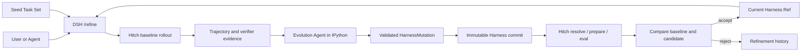

# DSH Self-Evolving Harness Plugin Spec

- 状态：Draft v0.2
- 目标运行时：DeepSeek Harness（DSH）
- 设计参考：Prime Agent persistent IPython + `/refine`
- 版本与评测后端：Hitch 0.1.x
- 更新：2026-08-19 — v0.2：采纳"cell 执行入 session 日志"的日志重建原则；补充双层模型与成本分层；轨迹 JSONL 消费契约；baseline 复用；评测两层隔离；DSH 落地规范要求

## 1. 目标

实现一个运行在 DSH 内的自进化 Harness plugin：

1. 为每个 DSH session 提供持久 IPython 环境；
2. 提供 `/refine`，根据指定 Seed Task 分析当前 Harness，并在受限动作空间内生成、验证和评测改进；
3. 使用 Hitch 管理不可变 Harness revision、构建产物、隔离运行、评测记录和回滚所需历史。

V1 只演进 Harness，不演进 Seed Task、模型或 DSH Agent Loop。

## 2. 核心原则

- **小步修改**：一次 refinement 只修改一个语义目标，便于归因和回滚。
- **证据驱动**：每个修改必须引用 Seed Task trajectory、错误或 verifier 结果。
- **先计划后应用**：proposal 生成期间不修改 Harness；应用前使用 parent digest 做 CAS 检查。
- **候选隔离**：candidate 不修改当前 champion，也不在当前 turn 中热替换正在执行的 Harness。
- **评测决定激活**：candidate 通过相同 Seed Task、模型、环境和预算的对照评测后才能成为 champion。
- **基础层不可变**：原始 DSH system prompt、模型、权限和 evaluator 不属于自动修改范围；`system_prompt` mutation 只修改 supplemental prompt layer。
- **日志重建**：模型的决策依据必须可从 session 日志重放（`cell/run` 入日志）；IPython 变量只是可丢弃的便利状态，不是真相源。
- **两层隔离**：评测的版本隔离（固定 dsh 版本，保证可归因）与进程安全（Harbor / 该版本 dsh 自身 sandbox）是两个正交维度，不混用。

## 3. 架构



DSH plugin 包含五个组件：

- `PythonNotebookRuntime`：管理 per-session IPython kernel；
- `RefineCommand`：注册 DSH `/refine` slash command；
- `RefineService`：执行 refinement 状态机；
- `HarnessLoader`：把 champion/candidate overlay 装配进 DSH；
- `HitchClient`：只调用 Hitch CLI、daemon 和 schema，不复制 Hitch 内部实现。

## 4. Persistent IPython

每个 DSH session 拥有一个独立 kernel。kernel 在多次 tool call 和 context compaction 之间保持变量、import、函数和分析结果。

IPython 的设计理由是**上下文外置（context offloading）**：分析状态放在环境里，模型只传递引用、不传递值。

- **引用优于值**：模型说"用 baseline_metrics 对比 candidate_metrics"，上下文里只有符号，值在 kernel 里——上下文变短、KV 命中率上升、推理成本下降；
- **编排性**：分析逻辑（读轨迹 → 清洗 → 聚合 → 统计）写成 cell 序列，中间结果保留、逐步可审查，分析代码本身成为可 diff、可沉淀为 skill 的 harness 组件；
- **长任务连续性**：变量跨 tool call 和 compaction 保持，compaction 压缩上下文不丢分析状态。

模型可见工具：

```ts
interface IpythonInput {
  code: string
}
```

最低能力：

- cell 串行执行，支持 stdout、stderr、result、display 和异常；
- 支持 interrupt、restart、dispose；
- 可选 safe snapshot，session resume 时逐变量恢复——**便利功能，不是真相源**；变量缺失可重算，session 日志不可丢；
- kernel restart 后撤销旧 generation 的 Host Bridge handle；
- kernel 不保存模型 credential、Hitch token 或 DSH Host authority。

### 日志与回放（模型可见 ⟺ 已入日志）

- 每个 cell 的**输入代码 + 输出结果**作为一个 session event 追加进 session 日志（`cell/run`）；
- 模型引用变量而做出的决策，其依据（cell 输出）必须能从日志重放得到——模型视角可由日志重建；
- 变量值本身是衍生状态，不入日志；snapshot 是可丢弃的恢复便利，resume 后缺失的变量通过重放 `cell/run` 重算；
- `cell/run` 事件同时是 trajectory 证据的一部分，供外层 meta agent 分析与归因。

预加载的 typed Python API：

```python
harness.current()                 # 当前 Harness manifest 和 ref
seed_tasks.load(ref)              # 读取 Seed Task Set
trajectory.query(round_id, ...)   # 分析 rollout evidence
await hitch.status(run_id)        # 查询 Hitch run/eval
await refine.run(seed_tasks=...)  # 与 /refine 共用 RefineService
```

Python API 通过 DSH Host Bridge 执行。kernel 可以分析和提交 proposal，但不能直接写 Harness repo、创建 commit 或切换 champion。

## 5. Harness 与动作空间

一个 Harness revision 是可由 DSH 加载的不可变 overlay：

```text
harness/
  manifest.json
  prompts/
  memories/
  skills/
  hooks/
  workflows/
```

```ts
interface HarnessManifest {
  schemaVersion: 1
  parentRef?: string
  dshRevision: string
  artifacts: Array<{ path: string; digest: string }>
  digest: string
}

interface HarnessMutation {
  parentRef: string
  parentDigest: string
  target: SemanticTarget
  ops: ArtifactOp[]
  rationale: string
  evidenceRefs: string[]
  expectedOutcome: string
}

type ArtifactOp =
  | { type: 'create'; path: string; content: string; expect: 'absent' }
  | { type: 'patch'; path: string; patch: string; expectedDigest: string }
  | { type: 'delete'; path: string; expectedDigest: string }
```

V1 动作空间：

| Target | 可修改组件 |
| --- | --- |
| `context` | supplemental system prompt、skill catalog、tool visibility、history policy、memory retrieval、ordering |
| `pre_action` | validation、routing、planning |
| `post_action` | normalization、reflection、retry、experience extraction、workflow update |
| `skill` | trigger、policy、capabilities、context、verifier、recovery |
| `routing` | tool、skill、subagent routing；模型和 provider 固定 |
| `memory` | retrieval、write policy、retention |
| `verifier` | correctness、quality、safety、cost；candidate verifier 不能单独决定自身 promotion |

默认一次 Mutation 只能命中表中的一个组件。绝对路径、`..`、symlink escape、任意 shell operation 和修改 evaluator/Hitch/权限的操作必须被拒绝。

## 6. `/refine` 合同

```text
/refine <seed-task-ref> [--rounds N] [--budget B] [--target TARGET]
/refine status [ROUND_ID]
/refine rollback <HARNESS_REF>
```

`/refine` 运行在 DSH command plane，不作为普通 user message 发送给 Target Agent。`await refine.run(...)` 与 slash command 调用同一个服务，并在当前 turn 结束后的 idle boundary 执行。

### 双层模型与成本分层

refinement 循环由两个模型角色构成，角色分离是刻意的：

| 角色 | 职责 | 模型策略 |
| --- | --- | --- |
| **meta agent（外层）** | 读轨迹、verifier 结果和 refinement history，输出 `HarnessMutation`；只做决策，不执行任务 | 成本分层：使用便宜的中档模型。harness-updating 能力不挑模型，贵模型不带来明显更好的提案 |
| **rollout agent（内层）** | 用固定 dsh revision + candidate overlay 执行 Seed Task，产出轨迹 JSONL 和分数；只执行与产证据，不做决策 | 评测对等性：同一轮 baseline/candidate 使用完全相同模型、provider、sampling 参数（第 8 节） |

两层之间的数据契约不对称：meta 产出 `HarnessMutation`（JSON，小、决策），rollout 产出轨迹（JSONL，大、证据）。meta agent（即下文流程中的 Evolution Agent）运行在独立 DSH session，拥有自己的 scope 和 session 日志，经 `/refine` 命令或 idle boundary 维护任务唤醒；它不接触 champion 之外未验证的 harness 内容。

每轮流程：

1. 固定 champion、Seed Task Set、模型、DSH revision、环境、seed 和预算；
2. 使用 Hitch 对 champion 执行 baseline rollout；
3. meta agent（Evolution Agent）在独立 DSH session/IPython kernel 中读取 Harness、trajectory、verifier 结果和 refinement history；
4. 输出一个 JSON `HarnessMutation`；没有充分证据时输出空 proposal；
5. 校验动作空间、风险、路径和 parent digest；
6. 在专用 Harness Git repo 中应用 mutation 并创建不可变 candidate commit；
7. 使用 Hitch resolve/prepare candidate，并对 baseline/candidate 执行匹配评测；
8. 满足 hard constraints 且 score 改善达到阈值时更新 champion pointer，否则保留原 champion；
9. 记录 proposal、diff、evidence、Hitch refs、score、decision 和 rollback target。

`--rounds N` 重复上述过程；下一轮只能基于上一轮接受的 champion。失败或拒绝的 candidate 不得成为后续 parent。

champion 未改变时，baseline rollout 结果在相邻轮之间可复用；只有 candidate 需要全量评测。champion 变化后，下一轮必须重新执行 baseline。

## 7. Hitch 集成

Harness Git commit 是版本 ID，Hitch 是 revision、artifact、run 和 eval 的权威执行记录：

```text
hitch resolve dsh-evolving@commit:<sha> --json
hitch prepare dsh-evolving@commit:<sha> --json
hitch run --harness dsh-evolving@commit:<sha> --output jsonl ...
hitch eval run --backend harbor --harness dsh-evolving@commit:<sha> ...
```

V1 直接复用 Hitch 已实现的：

- exact commit resolution 和 content identity；
- prepared artifact cache；
- run supervision、timeout、cancel 和 terminal status；
- `worktree | copy` workspace isolation；
- authenticated daemon queue；
- Harbor eval、trial 和 reward records。

需要新增一个薄的 Hitch harness definition：`dsh-evolving`。它负责从指定 commit 构建 DSH overlay，固定 `dshRevision`，并启动 DSH headless profile；不得重写 Hitch resolver、artifact store、scheduler 或 process supervisor。

Hitch Harbor 一次只评测一个 Harness ref，因此 baseline 和 candidate 使用两次参数完全一致的 eval，由 `RefineService` 合并结果。Hitch workspace 不是安全 sandbox；executable hook/tool candidate 必须使用 Harbor Docker。

### 轨迹 JSONL 消费契约

rollout 产出的轨迹 JSONL 是 meta agent 的证据输入。plugin 只消费、不复制：Hitch run 文件是权威，plugin 记录引用位置。

最小消费字段：`roundId`、`harnessRef`、`taskRef`、事件类型与时间序、verifier 结果与分数。大输出经 spill 定位符引用，不内联进 JSONL。轨迹 schema 由 Hitch run 产出格式决定，plugin 不做格式重写。

Hitch 不决定哪个版本是 champion。DSH plugin 只维护一个最小索引：

```ts
interface RefinementRecord {
  id: string
  parentRef: string
  candidateRef?: string
  mutationRef?: string
  baselineRunRefs: string[]
  candidateRunRefs: string[]
  decision: 'accepted' | 'rejected' | 'failed'
  scoreDelta?: number
  createdAt: string
}
```

该索引只保存 lineage 和 Hitch record reference；不复制 Hitch artifact、event 或 terminal state。

## 8. 评测与激活

baseline 和 candidate 必须使用相同：

- Seed Task revision 和任务顺序；
- 模型、provider 和 sampling 参数；
- DSH base revision；
- workspace image、permission、seed、timeout 和 token budget；
- verifier 和评分公式。

自动接受仅适用于 declarative mutation。修改 executable hook、tool 或 verifier code 的 candidate 即使得分更高，也需要人工确认；权限、网络、credential、模型和 evaluator 变更永不自动接受。

### 两层隔离

评测环境包含两个正交的隔离维度，不能混用：

- **版本隔离**：评测沙箱固定某次迭代后的 dsh 版本（revision + candidate overlay），让该版本 dsh 以同 seed、同模型、同预算执行 Seed Task——隔离 harness 组合的确定性，保证分数差异可归因于 harness diff，而非运行时漂移；
- **进程安全**：执行不可信代码（模型生成的候选 hook/tool）用 Harbor Docker；rollout 过程中模型经工具执行的代码仍由该版本 dsh 自身配置的 sandbox 管辖。Hitch workspace 不是进程安全边界。

champion 只在任务边界更新。新任务由 `HarnessLoader` 加载新 ref；正在运行的 session 不热替换。rollback 只移动 champion pointer 到已存在且验证过的 Harness ref。

## 9. 最小持久化

```text
.dsh-refine/
  champion.json
  rounds/<round-id>.json

<harness-repo>/
  harness/...

<hitch-root>/
  store/
  runs/
  evals/
  workspaces/
```

`<hitch-root>` 必须位于被管理的 source repo 之外，并由 Hitch 独占写入。

## 10. V1 验收标准

### DSH 落地规范要求

作为 DSH package 落地时，必须满足仓库开发规范：

- `refine/*` 类型化事件域（`cell/run`、`refine/start`、`refine/decision` 等），每个事件带 `@mode` 与 payload `@param`，经声明合并注册；
- Python 运行时按 capability seam 拆分（Service Definition / Provider / Consumer），并论证与既有 `code-runtime`、`terminal` 缝的边界；
- 包级 `./invariant`：如"accepted 记录必有一对 baseline/candidate Hitch run refs""champion 必为已验证 ref"；
- 非 unit REAL-composition 测试（boot cordis.yml 断言 durable 输出）、关键路径 snapshot、HMR-safe dispose 测试；
- 模型可见工具（IPython、refine 相关）确定 UI render intent（`generic`/`terminal`/`diff`）；
- 跨边界 id（`HarnessRef`、`RoundId`、`MutationRef`）使用 `Branded<B>`；
- 同步更新 packages README、module-graph、docs/architecture.md 扩展点表；附 Agent Note。

### 验收条目

- IPython 状态跨 tool call 和 compaction 保持，interrupt/restart/dispose 不遗留失控 kernel；
- `/refine` 能在指定 Seed Task 上产生 baseline evidence；
- proposal 只能包含动作空间内的单一语义修改，并携带 evidence 和 expected outcome；
- parent digest 冲突时 candidate 不会被部分应用；
- 每个 candidate 都对应一个 exact Hitch commit ref，重复 resolve 得到相同 identity；
- baseline/candidate 评测除 Harness diff 外完全一致，并能反查 Hitch run/eval records；
- rejected/failed candidate 不改变 champion，accepted candidate 只在任务边界生效；
- rollback 不重建旧版本，只切换到已有 immutable ref；
- DSH plugin 不复制 Hitch 的版本解析、artifact cache、进程、workspace 或评测状态机；
- 每个 cell 执行（`cell/run`）可自 session 日志重放，模型引用变量所做的决策均可从日志重建依据；
- champion 未变时相邻轮复用 baseline 结果，champion 变化后强制重新 baseline；
- 版本隔离与进程安全两层隔离各自归属明确，评测结果可归因于 harness diff。

## 11. 非目标

- 完整 GEAR Supervisor 或 Data Infra；
- Seed Task 生成、模型训练或 checkpoint evolution；
- 在运行中的 turn 内自修改；
- 自动修改权限、credential、网络策略、模型、evaluator 或 DSH Agent Loop；
- 把 IPython 当作安全 sandbox。

## 12. 设计参考

- [Prime Agent refinement implementation](../../agentfw/prime-agent/packages/coding-agent/src/core/refinement/refinement.ts)
- [Prime Agent IPython tool](../../agentfw/prime-agent/packages/coding-agent/src/core/tools/ipython.ts)
- [Prime Agent kernel manager](../../agentfw/prime-agent/packages/coding-agent/src/core/kernel/index.ts)
- [Prime Agent RLM programming model](../../agentfw/prime-agent/packages/coding-agent/docs/rlm.md)
- [DSH command subsystem](../../agentfw/deepseek-harness/docs/subsystems/commands.md)
- [Hitch README](../../agent-hitch/README.md)
- [Hitch design](../../agent-hitch/docs/design.md)
- [Hitch Harbor evaluation](../../agent-hitch/docs/evals.md)
- [RSI Harness Action Space](https://my.feishu.cn/wiki/ZsTUwNqC6i0Ot0kVZqAcZqv3nrh)
